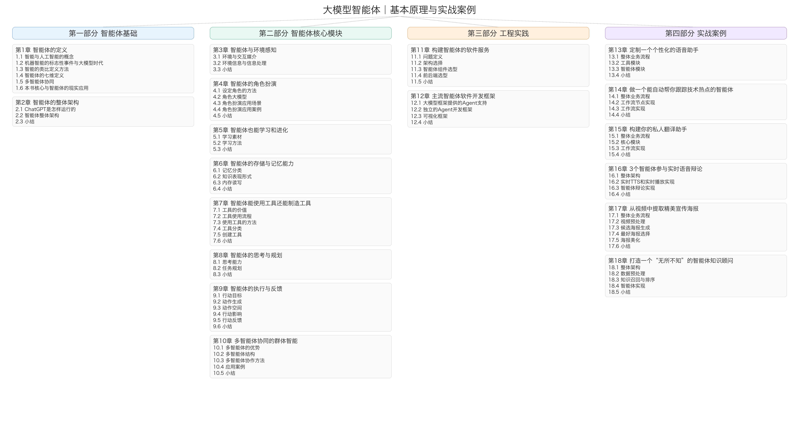

# llm_agent_abc

本项目由数艾缘知（上海）科技有限公司开发，面向“大模型智能体”学习与实践的开源代码与配套资料。
AIspire科研助手 的方法论与工程实践在这里落地，希望帮助读者从原理走到实战，做出可复用、可迭代的智能体应用。

## 1. 项目结构

本项目包含 6 个案例，每个案例都有对应的代码与说明：

- `agent_adviser`：智能体知识顾问
- `agent_debate`：3 个智能体语音辩论
- `audio_clone`：真人语音克隆并朗读文本
- `automated_article`：自动跟进热点论文并总结摘要
- `pdf_translate`：自动翻译英文 PDF 为中文 PDF
- `video_poster_generate`：自动从视频生成宣传海报

## 2. 快速开始

建议使用虚拟环境：

```bash
python -m venv .venv
source .venv/bin/activate
pip install -r requirements.txt
```

各案例的使用方式请参考对应目录内的说明文档。

## 3. 配套图书

《大模型智能体——基本原理与实战案例》已开源，点击阅读：
[PDF 在线阅读](book/大模型智能体——基本原理与实战案例.pdf)



第一部分：智能体基础。系统解释智能体的定义与整体架构，帮助读者建立完整的认知框架。

第二部分：智能体核心模块。围绕感知、角色、学习、记忆、工具、规划、执行与多智能体协同等能力展开，串起智能体的关键能力栈。

第三部分：工程实践。聚焦智能体软件服务的构建流程与框架选型，给出可落地的工程路径。

第四部分：实战案例。通过语音助手、热点追踪、翻译助手、多智能体辩论、海报生成、知识顾问等案例，展示从原理到应用的完整落地方式。

- GitHub 开源地址：https://github.com/Noevara/llm_agent_abc

## 4. 配套在线课程

在线课程链接：
http://mp.weixin.qq.com/mp/homepage?__biz=Mzk0MzE3MDEyNQ==&hid=23&sn=fa7d37a0d7f21bc6683e366e77fe1491&scene=18#wechat_redirect


## 5. AIspire 产品与社区

- 国内版：https://www.aispire.info
- 国际版：https://www.aispire.vip
- 微信小程序：AIspire

## 6. 支持

如果觉得我们的代码对你有帮助，可以给我们打赏，谢谢！


## 7. 联系作者

如果你（公司）有关于搜索、推荐、精细化运营、知识库、大模型赋能企业应用等相关需求，请联系我们。


